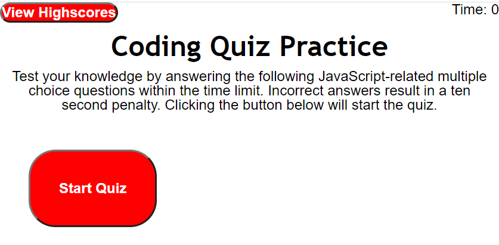

# HW04-WebAPIs-Code-Quiz

WebAPIs: Code Quiz

This is a webpage that allows you take a short quiz to test your coding knowledge. The html page is modified using JavaScript by using the DOM. CSS stylings are also modified using JavaScript. Scores are recorded using local storage.

Link to deployed application: [https://r134x7.github.io/HW04-WebAPIs-Code-Quiz/](https://r134x7.github.io/HW04-WebAPIs-Code-Quiz/)

This is only a screenshot: 
